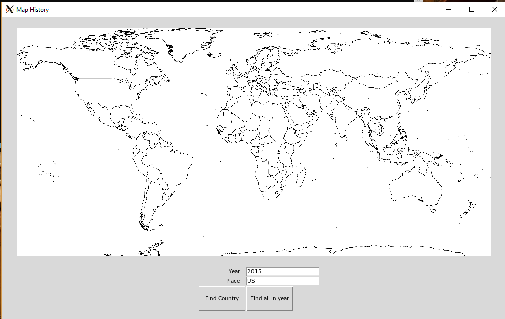
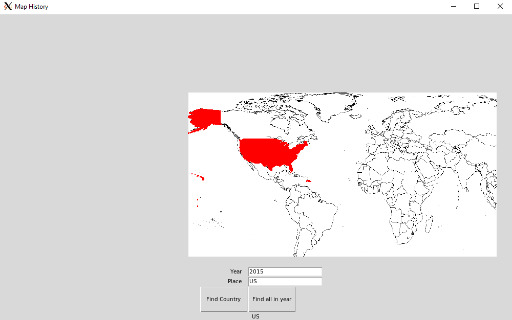

# Map History

**What is it?**  A program to demonstrate what areas of land were owned by at what time. In other words, an interactive political map. The interface allows the user to put in a year and the name of a place. The map will light up red wherever they owned land:

**How does it work?** The boundaries for countries are stored on a series of hand drawn political maps, one for each year where borders change (so most years). Creating these maps is still a work in progress. These maps are connected to a SQL database which links the rgb value on the map to the name of a country, as well as other information used by my calendar projects. The user interface takes in the desired year and place, runs a query for the rgb value, and then draws all pixels from the map that match that color. All this is displayed through the tkinter module in python.

**Project Goals, Skills and Tools** This project stems from videos like [this](https://www.youtube.com/watch?v=ewd4l2rD2_U) that show how the world changes over time. I wanted to make a version of this thats interactive and searchable. I also wanted some way to incorporate SQL into a project, as I have a little experience with it and want to get better.

Skills I developed on this project:
* Increasing efficency. I began the project by just trying to get working code. As I develop further, I've found that a number of pieces run way too slowly. Right now I'm working on streamlining those components
* Considering different operating systems. I usually focus on running a program a single way, which can obviously cause bugs in other systems. After experimenting with running my program from both the command line and the file explorer, I found my computer was running two different versions of python, and started to incorporate these possible differences into my code

Tools I've worked with:
* Though I've used python a bit before, this is my first project with it. Its also my first time working with the tkinter module and graphics in python.
* This is my first time working with SQL on an application. Though the SQL queries themselves are pretty basic, it took quite a bit of time to figure out how to link the database up to the python

**Moving Forward**  Most of the code is in place and a lot of the next steps are more research based, but there is a few improvements I'm working on:
* Make the map stay centered when zooming instead of gliding toward the corner
* Add a panning functionality
* Find a better way to zoom in on pixels
	* Right now it has to apply every zoom to every pixel, theres probably a way to calculate a single zoom to be applied
* Continue creating maps and adding to database
